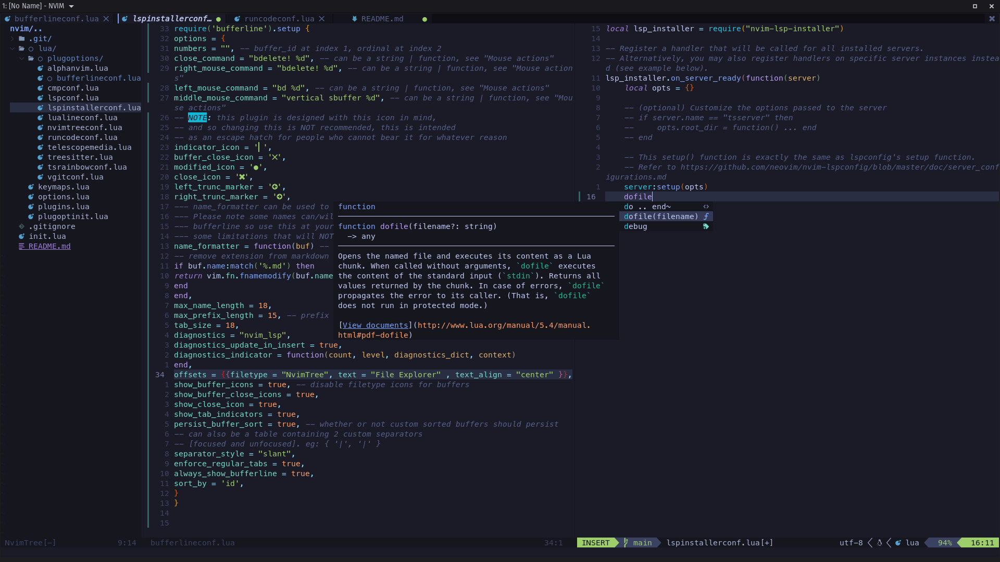

# My Neovim Config
I am a casual Linux (Pop OS) user that doesn't much do programing, but I wanted to ditch VSCode so I opted in to transition to Neovim with Packer as a plugin manager

> Stable as much it is possible

If you want to get the same font as mine, it's [Here](https://github.com/romkatv/powerlevel10k#meslo-nerd-font-patched-for-powerlevel10k)
# _That's all folks._
